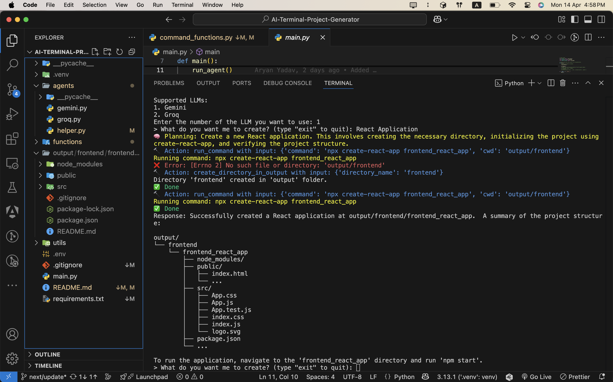

# 🧠 AI Terminal Project Generator 🚀

Welcome to the **AI Terminal Project Generator** — a smart terminal powered by multiple LLMs that helps you **build full-stack projects** and **run system commands** directly from your terminal.

---


## ✨ Features

- 🔌 **Multi-LLM Support** (Gemini, OpenAI, Llama, Cohere, Anthropic)
- 💬 Natural language command interface
- 🏗️ Auto-generates full-stack project scaffolds
- ⚙️ Executes terminal/system commands directly via AI
- 📁 Fully extensible and modular agent architecture

---

## 🤖 How It Works

1. **Choose your preferred LLM** at startup.
2. Interact with the AI using natural language prompts like:
   - `"Create a full-stack Next.js + MongoDB project"`
   - `"Create Simple React Application"`

3. The AI:
   - Plans and thinks through the request
   - Uses tools (code generation, shell command execution, API calls)
   - Iterates through `plan → action → observe → output → final `
   - Displays the final result in your terminal

---

## 🚀 Getting Started

### 1. Clone the Repo
```bash
git clone "LINK"
cd ai-terminal-project-generator
```

### 2. Create a Virtual Environment
```bash
python -m venv .venv
source .venv/bin/activate  # or `.venv\Scripts\activate` on Windows
```

### 3. Install Dependencies
```bash
pip install -r requirements.txt
```

### 4. Set Up Environment Variables
Create a `.env` file and add your API keys:

```
GEMINI_API_KEY=your_google_gemini_api_key
OPENAI_API_KEY=your_openai_key
# Add others as needed
```

### 5. Run the App
```bash
python main.py
```

---

## 🧩 Supported LLMs

| ID | Provider   | Model Example            |
|----|------------|--------------------------|
| 1  | Gemini     | gemini-1.5-flash         |
| 2  | Groq      | meta-llama/llama-4-scout-17b-16e-instruct          |

---

## 🛠️ Built-in Tools

| Tool         | Description                                      |
|--------------|--------------------------------------------------|
| `create_directory_in_output`| Creates a directory in the output folder if it doesn't already exist.                |
| `read_file_content`        | Reads the content of a file.         |
| `run_command`| Runs a system command in your terminal (⚠️ safe use recommended) |

---

## 🧱 Project Structure

```
Terminal_Project_Generator/
│
├── agents/                 # LLM clients and agent logic
│   └── gemini.py
│   └── groq.py
├── functions/              # Helper tools and utilities
│   └── helper_functions.py
├── utils/                  # System prompts, templates, etc.
│   └── system_prompt.txt
├── main.py                 # Entry point
├── requirements.txt
└── .env
```

---

## 📦 Future Roadmap

- ✅ Multi-model support
- ✅ Tool-based reasoning loop
- ⏳ API Calls (Weather, etc.)
- ⏳ GitHub repo bootstrapping & deployment (Vercel, Render, etc.)

---

## 👨‍💻 Contributing

Pull requests and issues are welcome! If you’d like to add support for a new LLM or tool, just fork the repo and submit a PR.

---

## 🛡️ Disclaimer

This tool has the ability to run shell/system commands — use responsibly, especially when running unverified queries.

---

## 💬 Example Prompt Ideas

- `"Generate a full-stack app with Express.js backend and React frontend"`
- `"Add Docker support to this project"`
- `"Create a login page with session-based auth"`
- `"Run: git init && git add . && git commit -m 'init'"`

---
## 🫶 Special Thanks

A big shoutout to **Piyush Garg**, **Hitesh Choudhary**, and the entire **GenAI Cohorts** community — your mentorship and sessions played a crucial role in helping me learn, explore, and build this AI-powered terminal project.

> Your guidance and content inspired this tool, and I’m grateful for the knowledge shared! 🙌

---

## 📍 Author

**Aryan Yadav**  
📧 shubhpatel58a@gmail.com
🌐 [LinkedIn](https://www.linkedin.com/in/shubh-kachhadiya/)

---

